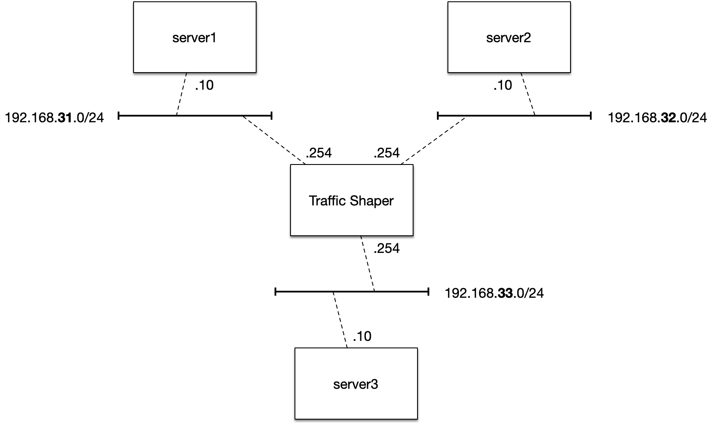

# Latency emulation in Vagrant

Measure the impact on HA setup of Elasticsearch, Redis, RabbitMQ and Kafka middleware using simulated latency provided by [Linux Traffic Control](https://en.wikipedia.org/wiki/Tc_(Linux)).

## Background

This is the premise of the problem: you are relaying on middleware software (Elasticsearch, Redis, RabbitMQ, doesn’t matter which kind) and need to simulate a low bandwidth or high latency connection for testing HA and fail-over.

The simplest way I’ve found to do is using [WANem](http://wanem.sourceforge.net/) - the Wide Area Network emulator.

Although this gets you up and running quickly, the ISO is no longer maintained and there are a lot of manual steps to perform considering network IP configuration -  hence I decided to implement my own box based upon `tc` and automate the configuration and deployment with Vagrant and Ansible to implement the following topology:

## Bring VMs up and running

~~~bash
# Start the traffic shaper device
# and 3 servers in different subnets
$ vagrant up
~~~
